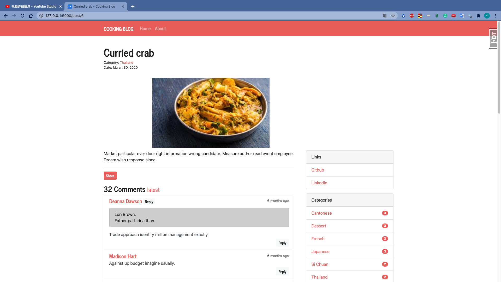

# Cooking Blog
# Demo

### Structure
.
|-- __init__.py
|-- blueprints
|   |-- __init__.py
|   |-- admin.py
|   |-- auth.py
|   |-- cook.py
|-- emails.py
|-- extensions.py
|-- fakes.py
|-- forms.py
|-- models.py
|-- settings.py
|-- static
|   |-- bakedSnail.jpeg
|   |-- beefRamen.jpg
|   |-- ccrab.jpeg
|   |-- charsiew.jpg
|   |-- css
|   |   |-- black_swan.min.css
|   |   |-- bootstrap-grid.css
|   |   |-- bootstrap-grid.css.map
|   |   |-- bootstrap-grid.min.css
|   |   |-- bootstrap-grid.min.css.map
|   |   |-- bootstrap-reboot.css
|   |   |-- bootstrap-reboot.css.map
|   |   |-- bootstrap-reboot.min.css
|   |   |-- bootstrap-reboot.min.css.map
|   |   |-- bootstrap.css
|   |   |-- bootstrap.css.map
|   |   |-- bootstrap.min.css
|   |   |-- bootstrap.min.css.map
|   |   |-- perfect_blue.min.css
|   |-- dumplings.jpg
|   |-- favicon.ico
|   |-- grlobster.jpg
|   |-- icecream.jpg
|   |-- js
|   |   |-- bootstrap.bundle.js
|   |   |-- bootstrap.bundle.js.map
|   |   |-- bootstrap.bundle.min.js
|   |   |-- bootstrap.bundle.min.js.map
|   |   |-- bootstrap.js
|   |   |-- bootstrap.js.map
|   |   |-- bootstrap.min.js
|   |   |-- bootstrap.min.js.map
|   |   |-- jquery-3.2.1.slim.min.js
|   |   |-- moment-with-locales.min.js
|   |   |-- popper.min.js
|   |-- pasta.jpg
|   |-- potatoSalad.png
|   |-- ricecake.jpeg
|   |-- salmon.jpg
|   |-- sgEggplant.jpg
|   |-- shrimps.jpg
|   |-- steak.jpg
|   |-- sushi.jpeg
|   |-- tcPork.jpeg
|   |-- tiramisu.jpg
|   |-- xiaolongbao.jpg
|-- templates
|   |-- admin
|   |   |-- edit_category.html
|   |   |-- edit_link.html
|   |   |-- edit_recipe.html
|   |   |-- manage_category.html
|   |   |-- manage_comment.html
|   |   |-- manage_link.html
|   |   |-- manage_post.html
|   |   |-- new_category.html
|   |   |-- new_link.html
|   |   |-- new_post.html
|   |   `-- settings.html
|   |-- auth
|   |   `-- login.html
|   |-- base.html
|   |-- cook
|   |   |-- _posts.html
|   |   |-- _sidebar.html
|   |   |-- about.html
|   |   |-- category.html
|   |   |-- index.html
|   |   `-- post.html
|   `-- error
|       |-- 400.html
|       |-- 404.html
|       `-- 500.html
`-- utils.py

### Designed functions:
User can see different categories of food 
### set up
pip install Flask-Bootstrap
pip install Flask-SQLAlchemy
pip install Flask-Mail
pip install Flask-CKEditor
pip install Flask-Moment

pip install faker

pip install django
pip install django.db

pip install flask_wtf
pip install flask_login
pip install flask_debugtoolbar
pip install flask_migrate

pip install pipenv
pipenv install unidecode
